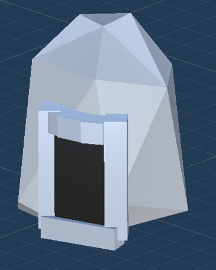

# ProtectMotherNature
An indie, run and gun game prototype created for the  HP Gaming Garage Sustainability Hackathon 2.0.
The game uses very basic models and <strong>DOES</strong> include many known bugs and issues but can still be played.

## Team Whitespace
- Khaled Aldasouki
- Rami Youhana

## Development Tools
- Unity 3D
- C#

## How to Execute 
1. Clone the repository or download it from the releases tab
2. open the folder and run "Hackathon.exe"

## Summary
The player controls a character that can run around and shoot projectiles at enemies while defending a crystal object in the center of the map. Enemies will try to attack the player and the objective while the player must defeat them and pick up crystals which they drop, picking up enough crystals spawns the final boss for this demo. The player wins if they defeat the boss without draining all their health or the objective being destroyed.

## Game Plot

Humans abandoned earth 50 years ago and have come back after realizing that natural materials and resources can only be found on their original home planet.

They tried to acquire “the heart of mother nature”, but it ended up splitting into 5 hearts, each with its own elemental powers .

Animals became more aware, and have been called for aid by mother nature, who’s heart they must now bring back to its original form in order to continue life on earth.

<emphasize>Please keep in mind that the prototype does not heavly reflect the plot and instead focuses on the main gameplay features</emphasize>

## Prototype Features
* A menu screen
* A help screen
* A point system
* 1 map
* 1 map interaction
* 1 main weapon and special ability
* 3 basic enemy types 
* Final boss 

### Player

The player can move, aim, fire, and reload their basic weapon, furthermore, the player has a special ability which fires a heavy projectile that does increased damage to enemies but has a long cooldown.

### Map

The map includes the crystal defense point that the player is tasked with defending, some terrain,and a tunnel which allows the player to teleport between 2 set points of the map quickly.

### Enemies

There are 3 basic types of enemies and a boss, each with unique behavior. Defeating enemies has a chance to drop a crystal, once 13 of which have been picked up the boss spawns.

#### Melee Enemy

* Target the closest entity between player or heart and move quickly
* Deal damage by colliding with the target
* Have the highest spawn chance 
 

#### Ranged Enemies

* Chase the player around and disregard the objective
* Shoot bullets at the player from afar
* Colliding with them deals a low amount of damage 
* Have a small amount of health
 

#### Objective Enemies

* Target the objective exclusively
* Deal large amounts of damage to the objective
* Cannot damage the player
* Walk extremely slowly but have more health
 

#### Level Boss

* Spawns once the player has collected 13 crystals
* Manifested the powers of the map element
* A larger, stronger variant of the ranged enemy that shoots at a much faster rate
* Will only target the player
* Deal significant melee damage 
* Drop 5 crystals upon death 
 

